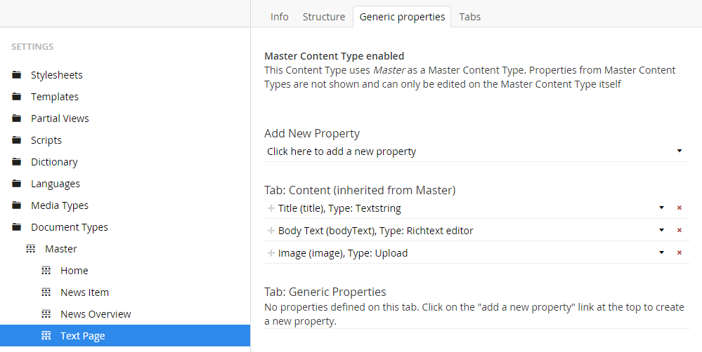

# Ditto

Ditto is a lightweight POCO mapper for Umbraco 7. It offers a generic solution to the problem of using **strongly-typed models in your MVC views**.
There are no 3rd party dependencies, other than Umbraco 7 core itself.

#### Is Ditto a "Yet Another Code-First" approach?

Nope! The goal of Ditto is to provide a simple way to convert your content/media nodes (e.g. `IPublishedContent`) to your desired POCO/model/object.

There is absolutely zero intention of generating Document-Types from your POCO/models.

## Getting Started

### Installation

> *Note:* Ditto has been developed against **Umbraco v7.1.4** and will support that version and above.

Ditto can be installed from either Our Umbraco or NuGet package repositories, or build manually from the source-code:

#### Our Umbraco package repository

To install from Our Umbraco, please download the package from:

> [http://our.umbraco.org/projects/developer-tools/ditto](http://our.umbraco.org/projects/developer-tools/ditto) 

#### NuGet package repository

To [install from NuGet](https://www.nuget.org/packages/Our.Umbraco.Ditto), you can run the following command from within Visual Studio:

	PM> Install-Package Our.Umbraco.Ditto

#### Manual build

If you prefer, you can compile Ditto yourself, you'll need:

* Visual Studio 2012 (or above)

To clone it locally click the "Clone in Windows" button above or run the following git commands.

	git clone https://github.com/leekelleher/umbraco-ditto.git umbraco-ditto
	cd umbraco-ditto
	.\build.cmd

---

### Usage

#### Basic usage - `As<T>` extension method

For basic use of Ditto, let's start with a standard DocumentType with a few properties: Title, Content and Image:

From that we will base the structure of our POCO model on those properties, we'd manually create a C# class:

	public class MyTextPage : Umbraco.Core.Models.PublishedContent.PublishedContentModel
	{
		public MyTextPage(Umbraco.Core.Models.IPublishedContent content) : base(content) { }
		
		public string Title { get; set; }
		
		public string BodyText { get; set; }
		
		public string Image { get; set; }
	}

> Note, that **the property names should corresponding with the DocumentType's property alias.** (If you wish to name your properties differently, then see the documentation about the `UmbracoProperty` attribute.)
> 
> The C# class name (`MyTextPage` in this example), does not need to match with the DocumentType alias.

Now you can map your `IPublishedContent` (content node of that DocumentType) to your corresponding POCO model using the `As<T>` extension method.

Here is an example of using the `As<T>` method within your Razor view:

	@using Our.Umbraco.Ditto
	@inherits UmbracoTemplatePage
	@{
		var poco = Model.Content.As<MyTextPage>();
	}
	<h1>@poco.Title</h1>
	@poco.Content
	

##### Video demonstration

* A short screencast giving [a brief introduction to Ditto](https://www.screenr.com/3oRN) (5 mins) 

#### Advanced usage - Property attributes

To extend the mapping functionality, Ditto offers two attributes to decorate your POCO models: `UmbracoProperty` and `DittoIgnore`:

##### `UmbracoProperty`

In situations where you would like to name a property in your POCO model differently to your DocumentType's property alias, you can use the `UmbracoProperty` attribute to define it.

Using the example POCO model from above (`MyTextPage` class), let's say that you wanted the `BodyText` property to be called `Content`.  You can do the following:

	[Our.Umbraco.Ditto.UmbracoProperty("bodyText")]
	public string Content { get; set; }

Now Ditto will know to map the POCO's `Content` property to the DocumentTypes 'bodyText' property.

##### `DittoIgnore`

For situations where you would rather that Ditto did not attempt to map a DocumentType property with one of your POCO models properties, you can use the `DittoIgnore` attribute:

	[Our.Umbraco.Ditto.DittoIgnore]
	public string Image { get; set; }

Now when you map your content node, the ignored property (in this example, `Image`) will be set as the default value for that type (in this case it's `null`).

The `DittoIgnore` attribute is useful for when you want to construct more complex POCO models.

#### Advanced usage - TypeConverters

Sooner or later you'll reach a point where you will want to map a DocumentType property with a complex .NET type (either from within the .NET Framework, or custom).  To map these types with Ditto, you can use a standard .NET `TypeConverter`.

> If you are not familiar with .NET TypeConverters, please read Scott Hanselman's blog post: [TypeConverters: There's not enough TypeDescripter.GetConverter in the world](http://www.hanselman.com/blog/TypeConvertersTheresNotEnoughTypeDescripterGetConverterInTheWorld.aspx). This gives a good 'real-world' understanding of their purpose.
> 
> Then from there, refer to the MSDN documentation on [How to: Implement a Type Converter](http://msdn.microsoft.com/en-gb/library/ayybcxe5.aspx) 

Now with our example, let's say that you wanted the `Content` (formerly `BodyText`) property to be of type `HtmlString` (rather than a basic `string`).  You can reference a custom `TypeConverter` by adding the following attribute to the POCO property:

	[System.ComponentModel.TypeConverter(typeof(HtmlStringConverter))]
	[Our.Umbraco.Ditto.UmbracoProperty("bodyText")]
	public System.Web.HtmlString Content { get; set; }

Then when the POCO property is populated the (raw) value (from `IPublishedContent`) will be processed through the custom `TypeConverter` and converted to the desired .NET type. 

Here is the example code for the `HtmlStringConverter`, that converts a `string` to a `HtmlString` object:

	public class HtmlStringConverter : TypeConverter
	{
		public override bool CanConvertFrom(ITypeDescriptorContext context, System.Type sourceType)
		{
			if (sourceType == typeof(string))
				return true;
	
			return base.CanConvertFrom(context, sourceType);
		}
	
		public override object ConvertFrom(ITypeDescriptorContext context, System.Globalization.CultureInfo culture, object value)
		{
				if (value is string)
					return new System.Web.HtmlString((string)value);
	
				return base.ConvertFrom(context, culture, value);
		}
	}

#### Advanced usage - `As<T>()` Event hooks

When using the `As<T>` extension method, there are two event hooks that you can use to manipulate the processing of the object being mapped: `ConvertingType` and `ConvertedType`.

> // TODO: Add example

These event hooks are called across Ditto mappings, regardless of DocumentType or POCO model.

#### Advanced usage - `As<T>()` Func delegates

Further to the `As<T>` event hooks, also available are two `Func` delegates for you to use to manipulate the mappings on a granular/ad-hoc level.

> // TODO: Add example

---

### Configuration

#### `IPublishedContent` Model Factory

As of v7.1.4, Umbraco ships with using a default model factory for `IPublishedContent`.
For more information about the [IPublishedContentModelFactory](https://github.com/zpqrtbnk/Zbu.ModelsBuilder/wiki/IPublishedContentModelFactory) please the "Zbu.ModelsBuilder" wiki:

> [https://github.com/zpqrtbnk/Zbu.ModelsBuilder/wiki/IPublishedContentModelFactory](https://github.com/zpqrtbnk/Zbu.ModelsBuilder/wiki/IPublishedContentModelFactory)

Ditto comes with a custom model factory, to enable this, use the following code:

	using Our.Umbraco.Ditto;

	public class ConfigurePublishedContentModelFactory : ApplicationEventHandler
	{
		protected override void ApplicationStarting(UmbracoApplicationBase umbracoApplication, ApplicationContext applicationContext)
		{
			var types = PluginManager.Current.ResolveTypes<PublishedContentModel>();
			var factory = new DittoPublishedContentModelFactory(types);
			PublishedContentModelFactoryResolver.Current.SetFactory(factory);
		}
	}

The factory will look for any POCO models that inherit from the `PublishedContentModel` class and automatically map those to the requested `IPublishedContent` objects.

#### Video demonstrations

* [Using Ditto with the `IPublishedContentModelFactory`](https://www.screenr.com/9oRN) (5 mins)
* [Using a custom Umbraco MVC controller with `IPublishedContentModelFactory` and Ditto]() (5 mins)

## Contributing to this project

Anyone and everyone is welcome to contribute. Please take a moment to review the [guidelines for contributing](CONTRIBUTING.md).

* [Bug reports](CONTRIBUTING.md#bugs)
* [Feature requests](CONTRIBUTING.md#features)
* [Pull requests](CONTRIBUTING.md#pull-requests)

## Contact

Have a question?

* [Ditto Forum](http://our.umbraco.org/projects/developer-tools/ditto/ditto-feedback/) on Our Umbraco
* [Raise an issue](https://github.com/leekelleher/umbraco-ditto/issues) on GitHub

## Ditto Team

* [Lee Kelleher](https://github.com/leekelleher)
* [Matt Brailsford](https://github.com/mattbrailsford)

Special thanks to [Darren Ferguson](https://github.com/darrenferguson) for inspiration in his article "[Mapping Umbraco content to POCOs for strongly typed views](http://24days.in/umbraco/2013/mapping-content-to-pocos/)" on the [24 days in Umbraco](http://24days.in/umbraco/) advent calender.

## License

Copyright &copy; 2014 Umbrella Inc, Our Umbraco and [other contributors](https://github.com/leekelleher/umbraco-ditto/graphs/contributors)

Licensed under the [MIT License](LICENSE.md)
